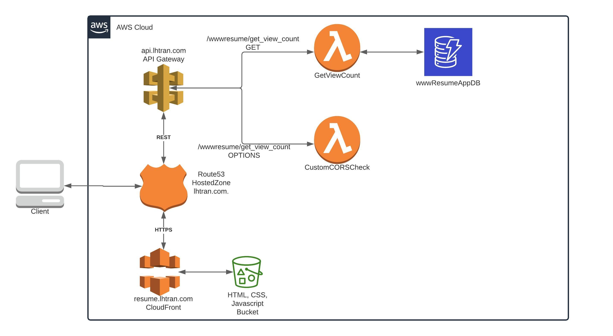

# www_resume_frontend
Website: https://resume.lhtran.com/

This project contains source code and supporting files for a front end of personal resume website to display view count. The website is hosted on AWS S3 and distributed by CloudFront. The source code is deployed with the CloudFormation template and Github Actions. It includes the following files and folders.

- www - HTML, CSS, Javascript of the website
- tests - Integration test for the website url. 
- template.yaml - CloudFormation template to deploy S3, CloudFront and R53
- .github/workflows/workflow.yml - Github workflow for CI/CD

Architecture:

Visit https://github.com/longhtran91/www_resume_backend for the Back End
